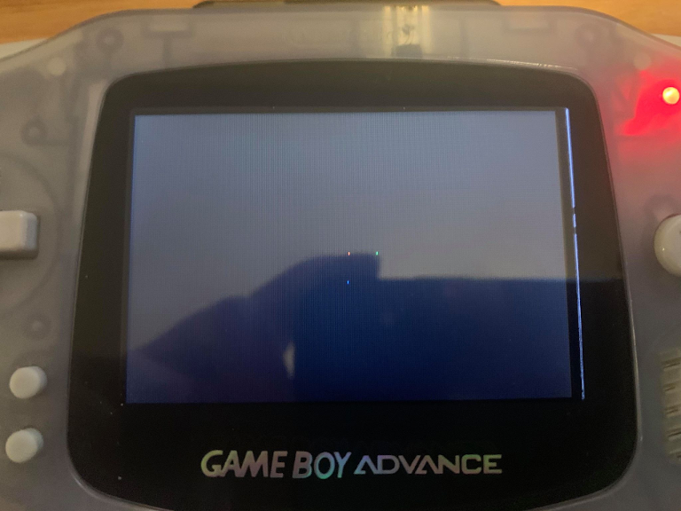

# Zig GBA "Hello World"

This is a simple GBA program that display 3 color pixel as a hello world to the system. Also a testament to the Zig excellent cross-compile functionally!

## Build
Simply use Zig's integrated build system
```Shell
zig build run
```

## Running in a emulator


## Running on real hardware

